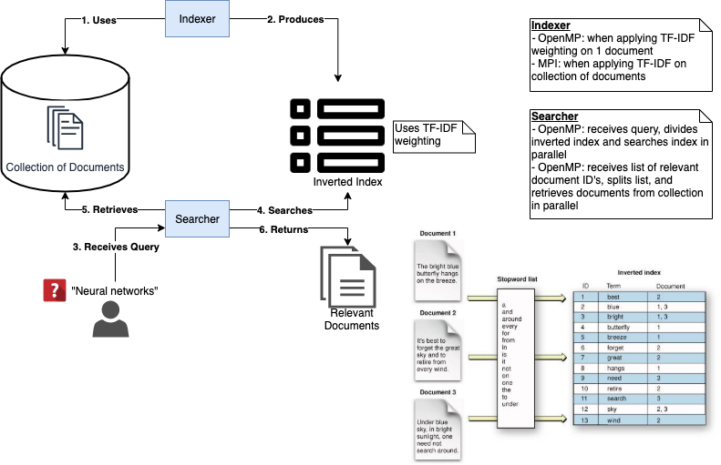

# Horus Text Miner

Parallel programming framework for efficient text mining.

<em>"The faster the better"</em>

## Meet The Team

<strong>Carlos Tezna</strong> 
<small>cteznas@eafit.edu.co</small> 

This project is a completely original implementation that relies heavily on theory, guidelines, and methods detailed in works found in the <strong>Reference</strong> section. I am an architect designer and programmer for Horus team.

<strong>Nicolas Gonzalez</strong> 
<small>ngonza27@eafit.edu.co</small> 

This project is a completely original implementation that relies heavily on theory, guidelines, and methods detailed in works found in the <strong>Reference</strong> section. I am a programmer for Horus team.

<strong>Andres Pulgarin</strong> 
<small>apulgar@eafit.edu.co</small> 

contribution to the project,contribution to the project,contribution to the project,contribution to the project,contribution to the project,contribution to the project,contribution to the project,contribution to the project

## Architecture

Please refer to https://github.com/ctezna/horus-text-miner/blob/master/docs/horus-text-miner-proposal.pdf for a more detailed documentation.

## References
[1] Grossman D.A., Frieder O. (2004) Parallel Information Retrieval. In: Information Retrieval. The Kluwer International Series on Information Retrieval, vol 15. Springer, Dordrecht. https://doi.org/10.1007/978-1-4020-3005-5_7  
[2] Jurafsky, D., & Martin, J. H. (2019). N-gram Language Models [PDF]. Stanford: University of Stanford.  
[3] Loiacono, D. (2010). Information Retrieval & Text Mining [PPT]. Milan: Politecnico di Milano.  
[4] Pecina, P. (2017). Probabilistic Models for Information Retrieval [PDF]. Maceió, Brazil: Universidad Federal de Alagoas.  
[5] Waterloo, U. (2010). Parallel Information Retrieval [PDF]. Boston: MIT Press.
[6] - D. Greene and P. Cunningham. "Practical Solutions to the Problem of Diagonal Dominance in Kernel Document Clustering", Proc. ICML 2006.