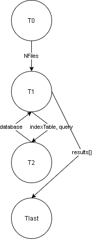
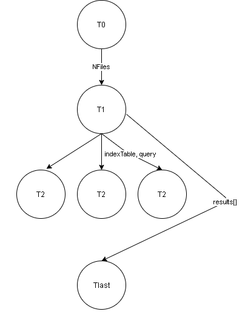
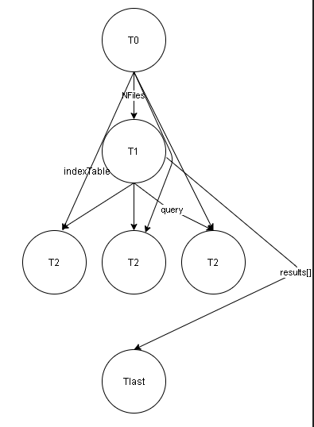
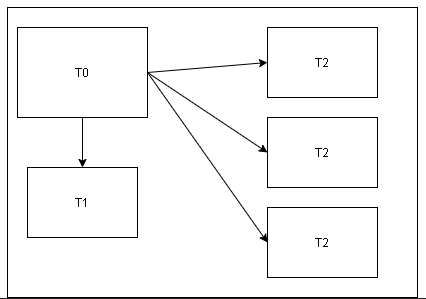

# [P]
~~~
T0:
    load(text)
    cleanDocuments()
    appearances = {}
    indexTable = {}

T1:
    for term in terms:
        if term.exists() :
            term.getFrequency()
        else:
            term.frequency = 0
        calculateIDF(term)
        appearances.update(term)
    indexTable.update(appearances)
    database.add(terms)

T2:
    cleanSearchTerms()
    terms = []
    results = {}
    for terms in query:
        terms.add(text.id, text.tfidf)
    resultss.update(sort(terms))

Tlast:
    for term in results:
        print(text.id, text.title, text.tfidf, text)
~~~ 

# [C]

# [A]

# [M]

